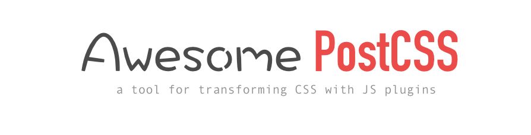

>  A curated list of PostCSS plugins, articles, videos and more.  Inspired by [awesome-flexbox](https://github.com/afonsopacifer/awesome-flexbox) and [awesome-svg](https://github.com/willianjusten/awesome-svg)

The offcial PostCSS resources page can be found [here](https://github.com/postcss/postcss).

## Table of Contents:

- [Awesome PostCSS](#awesome-postcss)
	- [Articles](topics/Articles.md)
	- [Grunt Plugins](topics/Grunt-plugins.md)
	- [Gulp Plugins](topics/Gulp-plugins.md)
	- [Guides](topics/Guides.md)

## How to contribute:

[To contribute, just follow the instructions in this guide.](topics\contributing.md)
