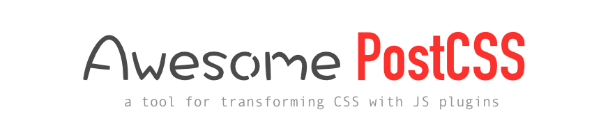

> A curated list of PostCSS plugins, articles, videos and more.
  Inspired by [awesome-flexbox](https://github.com/afonsopacifer/awesome-flexbox) and [awesome-svg](https://github.com/willianjusten/awesome-svg)

The offcial PostCSS resources page can be found [here](https://github.com/postcss/postcss).

## Table of Contents:

- [Articles](#articles)
- [Grunt Plugins](#grunt-plugins)
- [Gulp Plugins](#gulp-plugins)
- [Guides](#guides)

## Articles

* [A look into writing future CSS with PostCSS and cssnext](https://bigbitecreative.com/a-look-into-writing-future-css-with-postcss-cssnext/)
* [Breaking up with Sass: PostCSS](http://benfrain.com/breaking-up-with-sass-postcss/)
* [How to Build Your Own CSS Preprocessor With PostCSS](http://www.sitepoint.com/build-css-preprocessor-postcss/)
* [It's Time for Everyone to Learn About PostCSS](http://davidtheclark.com/its-time-for-everyone-to-learn-about-postcss/)
* [I'm Excited About PostCSS](http://davidtheclark.com/excited-about-postcss/)

## Plugins
* [A searchable catalog of PostCSS plugins](http://postcss.parts/)
* [This is a PostCSS plugin for adding Instagram filters to your photos.](https://github.com/azat-io/postcss-instagram)

## Grunt Plugins
> For those who use Grunt, some plugins to work with PostCSS.

* [Grunt-postcss](https://www.npmjs.com/package/grunt-postcss)
* [Grunt-postcss-import](https://www.npmjs.com/package/grunt-postcss-import)
* [Grunt-australian-stylesheets](https://www.npmjs.com/package/grunt-australian-stylesheets)

## Gulp Plugins
> For those who use Gulp, some plugins to work with PostCSS.

* [Gulp-autoprefixer](https://www.npmjs.com/package/gulp-autoprefixer/)
* [Gulp-postcss](https://www.npmjs.com/package/gulp-postcss/)
* [Gulp-australian-stylesheets](https://www.npmjs.com/package/gulp-australian-stylesheets/)
* [Gulp-rucksack](https://www.npmjs.com/package/gulp-rucksack/)
* [Gulp-pxtorem](https://www.npmjs.com/package/gulp-pxtorem/)
* [Gulp-html-postcss](https://www.npmjs.com/package/gulp-html-postcss/)

## Guides
> Guides for developers start their studies PostCSS.

* PostCSS Deep Dive:
    * [Create Your Own Plugin](http://webdesign.tutsplus.com/tutorials/postcss-deep-dive-create-your-own-plugin--cms-24605)
    * [Miscellaneous Goodies](http://webdesign.tutsplus.com/tutorials/postcss-deep-dive-miscellaneous-goodies--cms-24603)
    * [Preprocessing with “PreCSS”](http://webdesign.tutsplus.com/tutorials/postcss-deep-dive-preprocessing-with-precss--cms-24583)
    * [Roll Your Own Preprocessor](http://webdesign.tutsplus.com/tutorials/postcss-deep-dive-roll-your-own-preprocessor--cms-24584)
    * [Shortcuts and Shorthand](http://webdesign.tutsplus.com/tutorials/postcss-deep-dive-shortcuts-and-shorthand--cms-24602)
    * [What You Need to Know](http://webdesign.tutsplus.com/tutorials/postcss-deep-dive-what-you-need-to-know--cms-24535)
* PostCSS Quickstart Guide: 
    * [Exploring Plugins](http://webdesign.tutsplus.com/tutorials/postcss-quickstart-guide-exploring-plugins--cms-24566)
    * [Gulp Setup](http://webdesign.tutsplus.com/tutorials/postcss-quickstart-guide-gulp-setup--cms-24543)
    * [Grunt Setup](http://webdesign.tutsplus.com/tutorials/postcss-quickstart-guide-grunt-setup--cms-24545)
    * [Instant Setup Options](http://webdesign.tutsplus.com/tutorials/postcss-quickstart-guide-instant-setup-options--cms-24536)
* Using PostCSS:    
    * [for Minification and Optimization](http://webdesign.tutsplus.com/tutorials/using-postcss-for-minification-and-optimization--cms-24568)
    * [for Cross Browser Compatibility](http://webdesign.tutsplus.com/tutorials/using-postcss-for-cross-browser-compatibility--cms-24567)
    * [Together with Sass, Stylus, or LESS](http://webdesign.tutsplus.com/tutorials/using-postcss-together-with-sass-stylus-or-less--cms-24591)
    * [with BEM and SUIT Methodologies](http://webdesign.tutsplus.com/tutorials/using-postcss-with-bem-and-suit-methodologies--cms-24592)

## How to contribute:

To contribute, [just follow the instructions in this guide.](https://github.com/jjaderg/awesome-postcss/blob/master/contributing.md)
